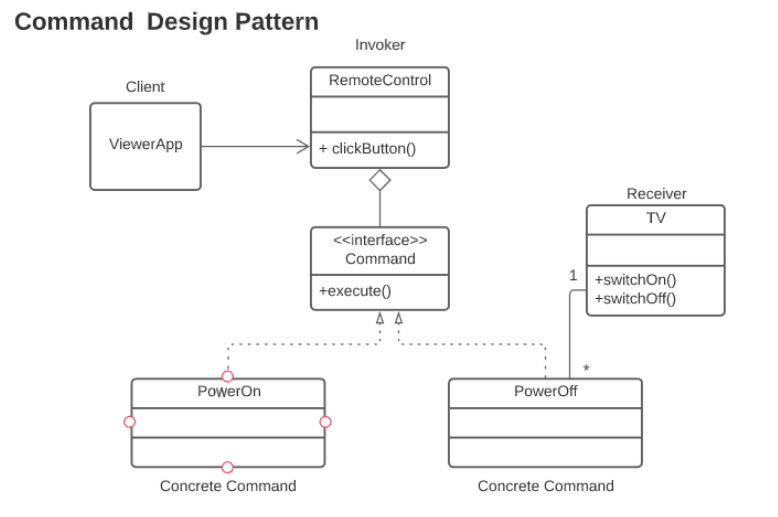

# Smart Home Automation - Command Pattern

## Problem Statement:
Imagine you're building a smart home automation system where various devices (lights, thermostat, music player, etc.) can be controlled remotely using a central hub or app. Each device has different functionalities, but you want to create a unified and flexible control mechanism.

## Design Pattern:
This solution uses the **Command Pattern** to decouple the actions (turning on/off, adjusting settings) from the central control system, allowing new devices to be added seamlessly.

## Classes:
- **Command Interface**: Defines the common interface for executing commands.
- **Concrete Commands**: Implements different actions (TurnOn, TurnOff, IncreaseTemperature, DecreaseVolume).
- **SmartDevice Interface**: Defines common actions (turnOn, turnOff) for all smart devices.
- **Concrete Devices**: Implements the specific actions for each device (Light, Thermostat, MusicPlayer).
- **RemoteControl**: The central hub that sets and executes commands.

## Usage:
The central hub (RemoteControl) sends high-level commands to control devices without needing to know their internal details.

### UML Diagram:

